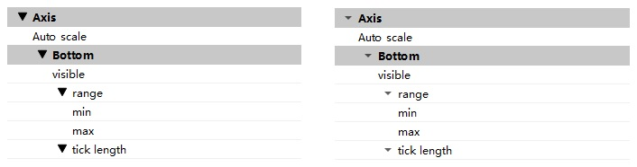
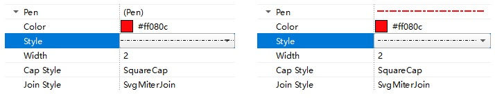

# QtnProperty
对QtnProperty的部分改进。

初始代码来自https://github.com/qtinuum/QtnProperty

### 改进1：升级到Qt6
支持Qt6.x环境编译。

### 改进2：动态delegate属性设置
主要在QtnPropertyBase类增加setDelegateAttribute成员方法，用于动态设置delegate属性，可在程序运行期间实时调整delegate属性。
一个应用场景是区间属性range，其有min、max两个子属性，其中min的最大值不能超过max，max的最小值不能低于min。通过动态delegate属性，使用QtnPropertyQPointF可满足以上需求。
具体可连接处理QtnPropertyQPointF的propertyDidChange信号，在槽函数中使用以下代码实现：

    if (reason & QtnPropertyChangeReasonValue) {
        auto prop = dynamic_cast<QtnPropertyBase*>(sender());
        auto var = prop->valueAsVariant();
        if (var.type() == QMetaType::QPointF) {
            auto val = var.value<QPointF>();
            QVariantMap attr;
            attr[qtnMinAttr()] = std::numeric_limits<qreal>::lowest();
            attr[qtnMaxAttr()] = val.y(); // 设置x的最大值为y
            prop->setDelegateAttribute("x", QVariant::fromValue(attr)); 

            attr.clear();
            attr[qtnMinAttr()] = val.x(); // 设置y的最小值为x
            attr[qtnMaxAttr()] = std::numeric_limits<qreal>::max();
            prop->setDelegateAttribute("y", QVariant::fromValue(attr), true);
        }

### 改进3：Branch-indicator绘制定制
主要在QtnPropertyDelegate类增加setBranchIndicatorStyle静态成员方法，可用于设置分支指示的绘制风格。目前提供default和native2种风格，分别对应于缺省Qtn风格与Qt内置风格。在程序运行初始化时，调用以下代码可设置Qt内置风格：

    QtnPropertyDelegate::setBranchIndicatorStyle(QtnPropertyDelegate::QtnBranchIndicatorStyleNative);

2种风格的对比如下图所示

### 改进4：优化QPen属性显示
主要有2处：一是在QPen属性value框中，以当前QPen线条代替原来的"(Pen)"文本；二是改进QPenStyle属性值显示，优化margin值，解决组合框线条与下三角指示重合的问题。前后比对图如下：

### 改进5：扩展QColor的alpha通道
打开QColor属性的alpha通道代码如下
    
    qtn->setDelegateAttribute(qtnShowAlphaChannelAttr(), true); // qtn为QtnPropertyQColor对象

### 改进6：允许对只读属性赋值

### 改进7：PropertySet可具属性
允许把PropertySet属性化，使用非常简单方便，示例代码如下

    #include "QtnProperty/PropertySetTyped.h"
    
    auto qtn = new QtnPropertyEnum(nullptr);
    auto ps = new QtnPropertySetTyped(qtn);
    ...

    

